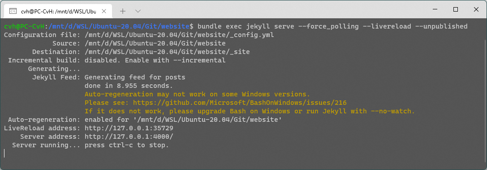

# Website

## Installation

#### Ubuntu dependencies

`sudo apt install ruby-full make gcc gpp build-essential zlib1g zlib1g-dev ruby-dev dh-autoreconf`

#### Update gem packages

`sudo gem update`

#### Install Gem bundler

`sudo gem install bundler`

#### Clone the website

`git clone https://github.com/LibreELEC/website.git`

#### Install Jekyll

`cd /path/to/git/website/`

`bundle install`

## Run the website from Linux

Run the command from the cloned website folder.

`bundle exec jekyll serve --livereload --unpublished --incremental`

## Run the website from Windows (WSL2)

It is possible to run Ruby natively in Windows but this is difficult to do. So in our example we just run it at WSL and bypass all those problems.

Run the command from the cloned website folder.

`bundle exec jekyll serve force_polling --livereload --unpublished`

## Display the website

After starting the server the website is autogenerated at every change excluding changes at `_config.yml` and `packages.json` that requires a restart of the server.

The website is now located at [http://127.0.0.1:4000/](http://127.0.0.1:4000) .
